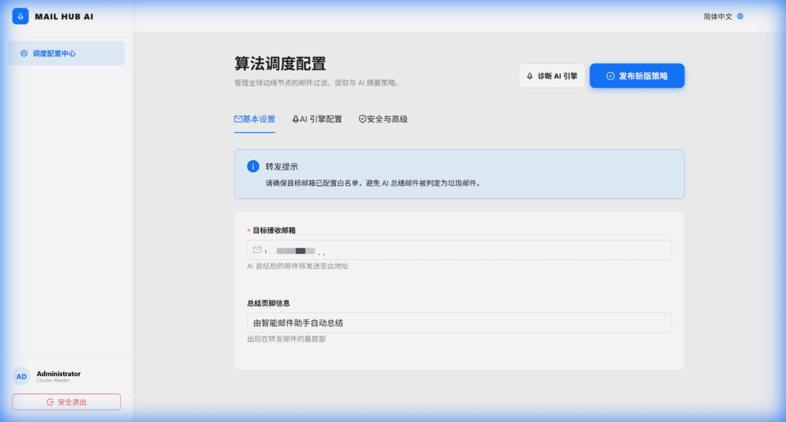
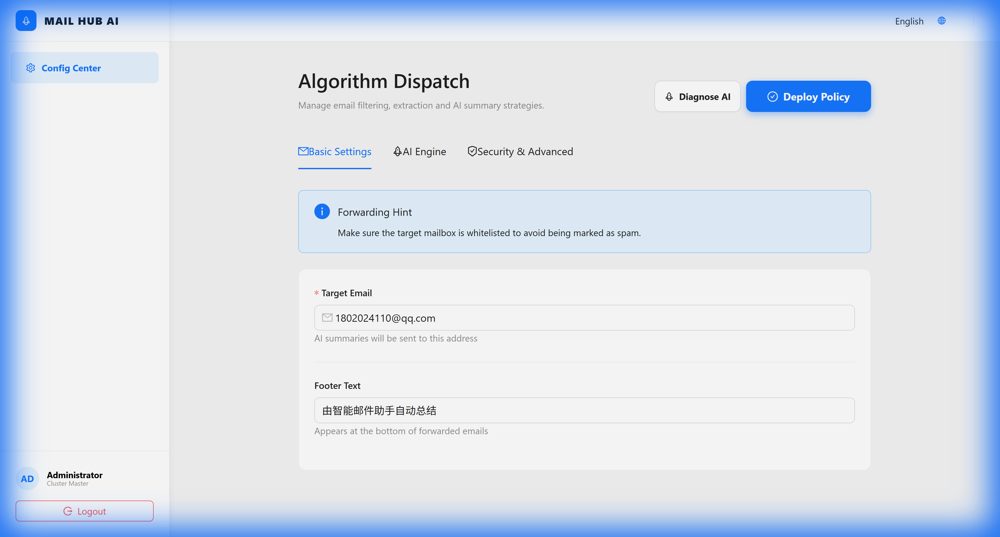

# ⛅ Cloudflare Email AI Worker (IntelEmail-Hub)

[简体中文](./README.md#简体中文) | [English](./README.md#english)

---

<a name="简体中文"></a>
## 🇨🇳 简体中文

IntelEmail-Hub 是一款部署在 Cloudflare Workers 上的智能邮件处理中枢。它利用大语言模型（LLM）对进站邮件进行自动分析、摘要并转发，助您在边缘侧高效管理海量信息。

### ✨ 核心特性

- **双 AI 引擎调度机制**: 
  - 主引擎：支持 OpenAI 兼容接口（如 GPT-4o, DeepSeek 等）。
  - 保底引擎：自动切换至 **Cloudflare Workers AI** (Llama 3.1)。
- **智能摘要提炼**: 自动提取标题、核心摘要、关键要点。
- **动态邮件转发**: 过滤垃圾信息并转发 AI 摘要报告。
  
- **专业管理后台**: 基于 React + Ant Design 的全量国际化配置中心。
  

### ✨ 多种安装方式

您可以根据自己的偏好选择以下任一方式进行部署：

#### 方案一：自动化一键部署 (推荐)
最简单的方式，适合大多数用户。
1. **克隆并进入目录**:
   ```bash
   git clone https://github.com/imHansiy/CloudflareEmailWorker.git && cd CloudflareEmailWorker
   ```
2. **初始化并部署**:
   ```bash
   npm install && npm run deploy
   ```
   *注意：程序会自动尝试关联您的 Cloudflare 账号，请根据终端提示完成授权。*

#### 方案二：手动分步骤部署 (适合开发者)
如果您需要更精细的控制或调试：
1. **安装依赖**: `npm install`
2. **构建前端**: `npm run build` (生成的产物位于 `dist/client`)
3. **创建 KV**: `npx wrangler kv:namespace create CONFIG_KV`
4. **修改配置**: 将上一步生成的 ID 填入 `wrangler.jsonc` 的 `kv_namespaces` 部分。
5. **最终发布**: `npx wrangler deploy`

#### 方案三：AI 自动化代理部署
如果您正在使用 Gemini, Claude 或 GPT 等 AI 助手：
- 直接将本项目路径提供给 AI，并嘱咐它：“请参考 [agents.md](https://github.com/imHansiy/CloudflareEmailWorker/raw/refs/heads/main/agents.md) 指南为我部署此项目”。AI 将会自动处理所有 KV 绑定和环境配置。

---

### 🛠 技术栈
Hono + React + Ant Design + Vite + Cloudflare KV/AI

### 📄 License
MIT © [imHansiy](https://github.com/imHansiy)

---

<a name="english"></a>
## 🌍 English

IntelEmail-Hub is an intelligent email processing agent deployed on Cloudflare Workers. It uses LLMs to automatically analyze, summarize, and forward emails.

### ✨ Key Features
- **Dual AI Engines**: Primary (OpenAI API) + Fallback (CF Workers AI).
- **Intelligent Summarization**: Auto-extracts titles, key points, and summaries.
  
- **Modern Admin UI**: Full i18n support (EN/ZH/JA) and real-time diagnostics.
  

### 🚀 Installation Methods

Choose the method that best fits your workflow:

#### Method 1: One-Click Automatic Deployment (Recommended)
1. **Clone & Enter**:
   ```bash
   git clone https://github.com/imHansiy/CloudflareEmailWorker.git && cd CloudflareEmailWorker
   ```
2. **Install & Deploy**:
   ```bash
   npm install && npm run deploy
   ```

#### Method 2: Manual Step-by-Step Deployment
1. **Install**: `npm install`
2. **Build**: `npm run build`
3. **Create KV**: `npx wrangler kv:namespace create CONFIG_KV`
4. **Config**: Update `wrangler.jsonc` with your new KV namespace ID.
5. **Push**: `npx wrangler deploy`

#### Method 3: AI Agent Assisted Deployment
If you are using an AI coding assistant (Gemini, Claude, GPT):
- Provide this repo to your agent and say: "Please deploy this project by following the instructions in [agents.md](https://github.com/imHansiy/CloudflareEmailWorker/raw/refs/heads/main/agents.md)". The agent will handle KV bindings and manifest updates autonomously.

---

### 🛠 Tech Stack
Hono, React, Ant Design, Vite, Cloudflare KV & Workers AI.

### 📄 License
MIT © [imHansiy](https://github.com/imHansiy)
